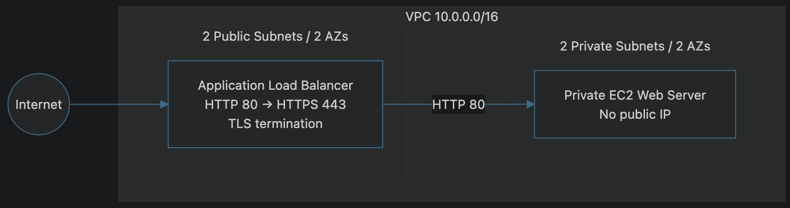

<h1 align="center">AWS Terraform Engineering Challenge</h1>

<p align="center">
  <strong>Terraform-defined AWS web infrastructure with reproducible deployment workflows, optional remote state, CI, and end-to-end verification.</strong>
</p>

<p align="center">
  <a href="https://github.com/pradeeptathineni/eng-challenge-aws-terraform/actions/workflows/terraform-ci.yml">
    
  </a>
</p>

<p align="center">
  <a href="#architecture">Architecture</a> •
  <a href="#configuration">Configuration</a> •
  <a href="#requirements">Requirements</a> •
  <a href="#commands">Commands</a> •
  <a href="#execution">Execution</a> •
  <a href="#continuous-integration">CI</a>
</p>

## Overview

This repository implements the AWS infrastructure defined in the original engineering challenge using Terraform.

The challenge itself is intentionally small; the repository was developed incrementally to also demonstrate the engineering around it: modular infrastructure, explicit configuration, repeatable Make/Bash workflows, local and remote Terraform state, AWS authentication handling, static CI checks, deployment verification, and safe teardown.

The commit history and supporting documentation preserve that progression and the decisions behind it rather than presenting only the final result.

| Area         | Implementation                                                                          |
| ------------ | --------------------------------------------------------------------------------------- |
| Networking   | VPC with two public and two private subnets across availability zones                   |
| Ingress      | Internet-facing Application Load Balancer                                               |
| TLS          | HTTPS termination using a Terraform-generated self-signed certificate in ACM            |
| Workload     | Private Amazon Linux 2023 EC2 web server with no public IP                              |
| State        | Local by default, with optional protected S3 remote state                               |
| Automation   | GNU Make and Bash workflows for deployment, state migration, verification, and teardown |
| CI           | GitHub Actions using the same static checks available locally                           |
| Verification | ALB target health, HTTP-to-HTTPS redirect, and expected HTTPS application response      |

> [!NOTE]
> The self-signed TLS certificate is intentional and follows the original challenge requirements. Clients will not trust it like a publicly issued certificate.

> [!CAUTION]
> Deploying this project creates AWS resources that may incur charges.

---

## Architecture



### Main Terraform Configuration

The default main-stack configuration includes:

- VPC — `10.0.0.0/16`
- Public subnets — `10.0.1.0/24`, `10.0.2.0/24`
- Private subnets — `10.0.30.0/24`, `10.0.40.0/24`
- Internet-facing ALB across both public subnets
- HTTP `80` redirected to HTTPS `443`
- Terraform-generated self-signed certificate imported into ACM
- Single private EC2 web server
- Security-group boundaries between the ALB and EC2 workload
- `alb_dns_name` and `ec2_private_ip` Terraform outputs

### Backend State Terraform Configuration

The main stack supports either local or remote state:

| Mode   | Behavior                                                                                                                  |
| ------ | ------------------------------------------------------------------------------------------------------------------------- |
| Local  | Default; Terraform state remains on the local machine                                                                     |
| Remote | State is stored in a dedicated S3 backend with versioning, encryption, blocked public access, and native S3 state locking |

Remote-state infrastructure is managed separately under [`bootstrap/`](bootstrap/), whose own small Terraform state remains local.

The <a href="#continuous-integration">backend workflows</a> can migrate the main-stack state between local and S3 storage without recreating the managed infrastructure.

> [!IMPORTANT]
> Terraform state can contain sensitive material, including the generated TLS private key, and is intentionally excluded from version control.

For deeper detail:

- [`docs/architecture.md`](docs/architecture.md) — complete project architecture
- [`docs/engineering-decisions.md`](docs/engineering-decisions.md) — engineering decisions throughout development
- [`docs/DevOpsChallenge.pdf`](docs/DevOpsChallenge.pdf) — original challenge criteria

---

## Repository Layout

| Path                                       | Purpose                                                     |
| ------------------------------------------ | ----------------------------------------------------------- |
| [`terraform/`](terraform/)                 | Main AWS infrastructure                                     |
| [`bootstrap/`](bootstrap/)                 | Optional S3 remote-state infrastructure                     |
| [`config/`](config/)                       | Version-controlled deployment configuration                 |
| [`scripts/`](scripts/)                     | AWS, Terraform, verification, and teardown automation       |
| [`docs/`](docs/)                           | Architecture, decisions, challenge criteria, and references |
| [`.github/workflows/`](.github/workflows/) | GitHub Actions CI                                           |
| [`Makefile`](Makefile)                     | Primary development and deployment interface                |

---

## Configuration

Deployment settings are publicly centralized under [`config/`](config/).

| File                                             | Controls                                          |
| ------------------------------------------------ | ------------------------------------------------- |
| [`config/project.tfvars`](config/project.tfvars) | Project identity, resource prefix, and AWS region |
| [`config/stack.tfvars`](config/stack.tfvars)     | VPC CIDR, subnet CIDRs, and EC2 instance type     |

These `.tfvars` files are intentionally committed because they contain non-sensitive deployment configuration.

Do not place credentials, secrets, private keys, or other sensitive values in them.

---

## Requirements

`make tools` verifies the expected local toolset and required versions before an end-to-end deployment begins.

| Tool                                                                                        | Requirement | Purpose                                          |
| ------------------------------------------------------------------------------------------- | ----------- | ------------------------------------------------ |
| [Git](https://git-scm.com/downloads)                                                        | Installed   | Repository workflow                              |
| [Bash](https://www.gnu.org/software/bash/)                                                  | Installed   | Automation scripts                               |
| [AWS CLI v2](https://docs.aws.amazon.com/cli/latest/userguide/getting-started-install.html) | `2.32.0+`   | AWS authentication and API operations            |
| [Terraform](https://developer.hashicorp.com/terraform/install)                              | `1.16.x`    | Infrastructure provisioning and state management |
| [GNU Make](https://www.gnu.org/software/make/)                                              | Installed   | Project command interface                        |
| [awk](https://www.gnu.org/software/gawk/)                                                   | Installed   | Shell processing and automation                  |
| [curl](https://curl.se/download.html)                                                       | Installed   | HTTP/HTTPS deployment verification               |

CI explicitly installs Terraform `1.16.0`.

For Windows, [Git for Windows](https://git-scm.com/download/win) provides Git Bash and the expected Bash environment. GNU Make can be installed separately through tools such as [Chocolatey](https://community.chocolatey.org/packages/make).

Clone the repository:

```bash
git clone https://github.com/pradeeptathineni/eng-challenge-aws-terraform.git
cd eng-challenge-aws-terraform
```

---

## Commands

The Makefile provides complete workflows for common operations while keeping each underlying operation independently available.

Run `make help` at any time for the current command list.

<details>
<summary><strong>End-to-End Workflows</strong></summary>

| E2E Command              | Purpose                                                                                         |
| ------------------------ | ----------------------------------------------------------------------------------------------- |
| `make e2e-local-deploy`  | Configure, authenticate, deploy with local state, and verify                                    |
| `make e2e-remote-deploy` | Configure, authenticate, deploy with remote S3 state, and verify                                |
| `make e2e-destroy`       | Destroy infrastructure, remote-state infrastructure when present, and local generated artifacts |

</details><br>

<details>
<summary><strong>Main Infrastructure Workflows</strong></summary>

| Command        | Purpose                                                                                   |
| -------------- | ----------------------------------------------------------------------------------------- |
| `make login`   | Log into AWS and verify the active identity                                               |
| `make check`   | Run all static project checks                                                             |
| `make plan`    | Check the project, verify AWS access, initialize state, and create a saved Terraform plan |
| `make apply`   | Verify AWS access and apply the saved Terraform plan                                      |
| `make verify`  | Verify the deployed infrastructure and application end-to-end                             |
| `make destroy` | Verify AWS access and destroy the main infrastructure                                     |

</details><br>

<details>
<summary><strong>State Backend Workflows</strong></summary>

| Command                    | Purpose                                                                          |
| -------------------------- | -------------------------------------------------------------------------------- |
| `make bootstrap-plan`      | Create a saved plan for optional remote-state infrastructure                     |
| `make bootstrap-plan-show` | Display the saved remote-state infrastructure plan                               |
| `make bootstrap-apply`     | Apply the saved remote-state infrastructure plan                                 |
| `make bootstrap-destroy`   | Permanently remove remote-state infrastructure after the main stack is destroyed |
| `make backend-remote`      | Enable S3 remote state and migrate existing local state when needed              |
| `make backend-local`       | Enable local state and migrate existing remote state when needed                 |

</details><br>

<details>
<summary><strong>Focused Helpers</strong></summary>

| Command                                | Purpose                                                         |
| -------------------------------------- | --------------------------------------------------------------- |
| `make help`                            | Show available commands                                         |
| `make tools`                           | Verify required local tools and versions                        |
| `make profile`                         | Select or configure an AWS CLI profile                          |
| `make auth`                            | Verify AWS credentials and display the active identity          |
| `make shell-validate`                  | Check Bash helper scripts for syntax errors                     |
| `make fmt`                             | Format all Terraform configuration                              |
| `make fmt-check`                       | Check Terraform formatting without modifying files              |
| `make validate`                        | Validate Terraform configuration without backend access         |
| `make init`                            | Initialize the currently selected main-stack backend            |
| `make plan-show`                       | Display the saved main-stack Terraform plan                     |
| `make output`                          | Display Terraform outputs from the current state                |
| `make state-list`                      | List resources tracked by Terraform state                       |
| `make state-show RESOURCE='<address>'` | Display one resource from Terraform state                       |
| `make clean`                           | Remove generated Terraform working files without deleting state |
| `make deep-clean`                      | Remove generated files and empty local state after teardown     |

</details><br>

---

## Execution

<details>
<summary><strong>End-to-End</strong></summary>

### Local Deployment

Deploy the complete stack using local Terraform state:

```bash
make e2e-local-deploy
```

### Remote Deployment

Bootstrap an S3 backend when needed, migrate or initialize the main state remotely, deploy, and verify:

```bash
make e2e-remote-deploy
```

Both deployment workflows perform tool checks, AWS profile selection, authentication, static validation, backend setup, planning, application, and end-to-end verification.

### Teardown

Destroy the main infrastructure, remove remote-state infrastructure when present, and clean the remaining local Terraform artifacts:

```bash
make e2e-destroy
```

`e2e-destroy` can be used after either local or remote deployment, really at any time.

> [!WARNING]
> Full teardown is irreversible. If remote state exists, its retained Terraform state history is permanently removed.

### Non-Interactive E2E Execution

Set `AUTO=1` to skip profile-selection and confirmation prompts. Requires `AWS_PROFILE` to be set.

```bash
make <E2E command> AUTO=1
```

For cleanup without destroying managed infrastructure, use `make clean`. After infrastructure has already been fully removed, `make deep-clean` can remove remaining local Terraform state and generated artifacts.

</details><br>

<details>
<summary><strong>Step-by-Step</strong></summary>

### 1. Verify Local Tools

```bash
make tools
```

### 2. Review Deployment Configuration

Review or modify the version-controlled settings under [`config/`](config/):

```text
config/
├── project.tfvars
└── stack.tfvars
```

These control project naming, AWS region, network ranges, and EC2 sizing.

### 3. Configure AWS Access

Select/create and set AWS CLI profile:

```bash
export AWS_PROFILE="$(make profile)"
```

Authenticate and verify the resulting AWS identity:

```bash
make login
```

The login workflow supports IAM Identity Center, AWS local development login, and configured credentials while reusing valid short-lived sessions when possible.

### 4. Choose a State Backend

Local state is the default and requires no separate bootstrap.

To use remote S3 state:

```bash
make bootstrap-plan
make bootstrap-apply
make backend-remote
```

Existing local main-stack state is migrated when applicable.

To migrate back to local state later, run `make backend-local`.

### 5. Validate and Plan

Run the complete static validation workflow:

```bash
make check
```

Create and review a saved Terraform plan:

```bash
make plan
```

Standalone `make plan` also performs the required checks, AWS identity verification, and backend initialization before planning.

### 6. Deploy

Apply the exact saved plan:

```bash
make apply
```

Inspect the resulting deployment when needed:

```bash
make output
make state-list
make state-show RESOURCE='<address>'
```

### 7. Verify

```bash
make verify
```

Verification waits for the ALB target to become healthy, confirms HTTP redirects to HTTPS, and checks for the expected application response.

### Teardown

#### Local State

Destroy the main infrastructure:

```bash
make destroy
```

#### Remote State

Destroy the main infrastructure before removing the backend:

```bash
make destroy
make bootstrap-destroy
```

> [!WARNING]
> Removing the remote backend permanently deletes its retained Terraform state history.

#### Final Cleanup

Remove generated artifacts, preserving local state files:

```bash
make clean
```

Remove generated artifacts and empty local state files:

```bash
make deep-clean
```

</details><br>

---

## Continuous Integration

GitHub Actions runs automatically on pushes and pull requests targeting `main`.

```text
Checkout
   ↓
Terraform 1.16.0
   ↓
make check
```

The current static workflow checks:

- Bash helper-script syntax
- Terraform formatting
- Version-controlled deployment configuration formatting
- Backend-disabled Terraform initialization
- Main-stack Terraform validation
- Bootstrap Terraform validation

CI intentionally requires no AWS credentials, Terraform state, or deployed infrastructure.

Authenticated remote planning or deployment can be added separately with GitHub Actions OIDC if needed.

---

## Documentation

| Document                                                         | Purpose                                          |
| ---------------------------------------------------------------- | ------------------------------------------------ |
| [`docs/architecture.md`](docs/architecture.md)                   | Complete infrastructure architecture             |
| [`docs/engineering-decisions.md`](docs/engineering-decisions.md) | Engineering decisions and project evolution      |
| [`docs/DevOpsChallenge.pdf`](docs/DevOpsChallenge.pdf)           | Original challenge criteria                      |
| [`docs/references.md`](docs/references.md)                       | Technical references used throughout development |

---

## References

See [`docs/references.md`](docs/references.md) for the AWS, Terraform, GitHub Actions, GNU Make, and other technical material referenced during implementation.
